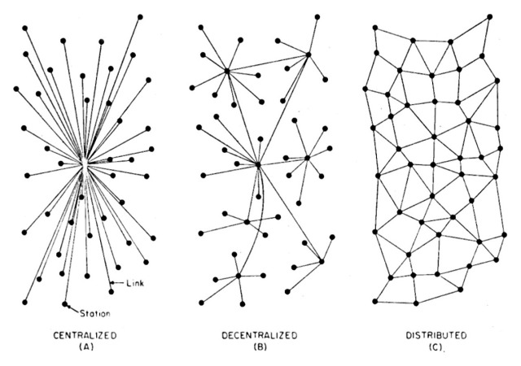
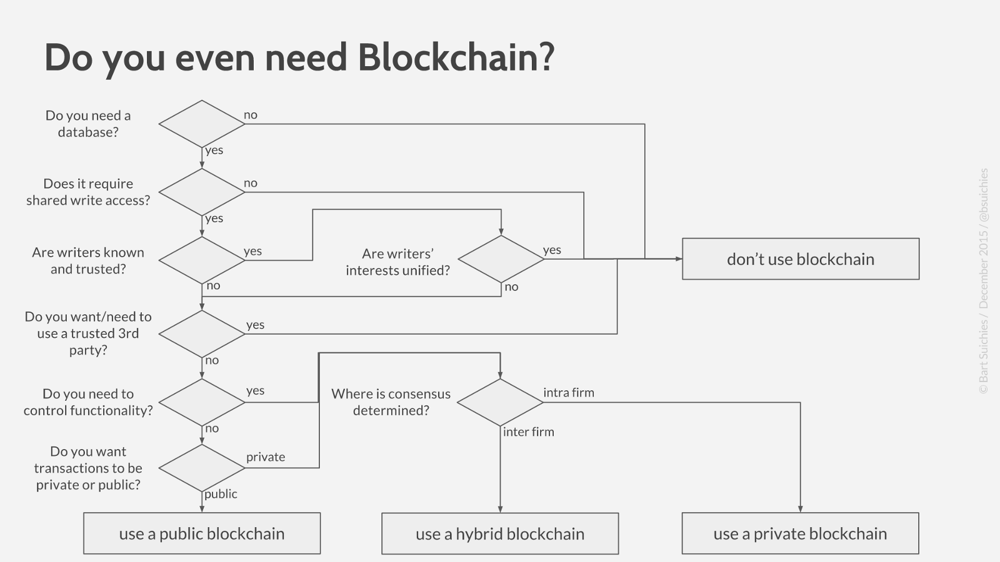

class: center, middle, inverse
# Feasibility of blockchain application as medium for collaborative systems or databases

Thesis introduction by Pelle Jacobs, October 21, 2016

Promoted by prof. Jochem De Weerdt and supervised by Vytautas Karalevicius

---

# Structure of the thesis

- What exactly do we **define as blockchain** and how does that work? What are other implementations of distributed ledger technology? What are the possibilities, advantages and disadvantages of blockchain?

- **Collaborative systems and databases**: what are distributed databases and decentralized databases, current issues and how are these issues currently dealt with.

- What are the use cases for blockchain over the current solutions for collaborative databases? Formulate a thinking **framework to evaluate blockchain feasibility on specific issues**.

---

class: center, middle, inverse

## 1. What is this blockchain you are talking about?

---
.footnote[1\. What is blockchain]

## What is blockchain?

####.center[_"Chain of blocks"_]

However, even over this definition, there is no real consensus, as often all Distributed Ledger Technologies are being marked as Blockchain.

Purpose of this part in the paper:

- solidly **define the concept of blockchain**, differentiating it from the more general concept of "Distributed Ledger Technology", to avoid any misunderstanding in the rest of the thesis.
- clearly explain what the **idea of blockchain concludes**. How are blockchains set up, how can they be used?

_eg. public vs private blockchain, permissioned vs unpermissioned, proof of work vs proof of stake, monetary transactions vs non-monetary transactions, smart contracts, etc._
- what are the **advantages and disadvantages** of implementing a collaborative database based on a blockchain

---

.footnote[1\. What is blockchain]

## Blockchain literature

As blockchain is a very young field of research, most of the literature available starts from the concept of Bitcoin:

- S. Nakamoto, "Bitcoin: A Peer-to-Peer Electronic Cash System", 2008
- A. M. Antonopoulos, "Mastering Bitcoin", 2015

---
class: center, middle, inverse

## 2. Collaborative databases

(P. Baran, "On Distributed Communication Networks", 1964)

---

.footnote[2\. Collaborative databases]

## Collaborative databases: distributed vs decentralized

In the part concerning collaborative databases, I will focus on two types of databases used for collaborative systems:

.pull-left[
**decentralized databases**

data is duplicated across several nodes that communicate with each other.

=> need for synchronization, eg. Facebook
]

.pull-right[
**distributed databases**

database that has information duplicated between all leafs, in which nodes might not necessarily trust each other.

=> need for consensus, eg. Bitcoin
]

---

.footnote[2\. Collaborative databases]

## Current issues with collaborative databases

I will look into the current issues of these forms of databases. Potential important issues:

- **consistency**: what is the truth?

  translates to 'consensus' for distributed databases and to 'synchronization' for decentralized databases.

- **structure**: complex databases result in complex and unwieldy structures
- **integrity and authenticity**: how do we make sure the data is the database is actually correct and authentic? How do we make sure no data disappears or gets maliciously altered?

Further, we will have a look a the current solutions for these issues and how they hold up. eg. Facebook's Cassandra

---

class: middle, center, inverse

## 3. Blockchain to the rescue?

(B. Suichies, "Why Blockchain must die in 2016", 2015)

---

.footnote[3\. Blockchain as solution for collaborative databases]

## How can blockchain solve problems with collaborative databases?

Combining the shortcomings of collaborative databases with the potential of blockchain, I will look into the potential to leverage the power of blockchain to solve the issues with collaborative systems

- The final purpose is to set up a framework to evaluate the potential of blockchain for a specific issue based on simple questions, or suggest a valuable alternative.

- Apply this framework on several real world examples: was / is it a good idea to start using a blockchain in this use case?

A popular hypothesis I am looking forward to evaluating:

_"The true power of blockchain lies in new issues that haven't been solved yet, instead of trying to replace current working solutions"_

---

class: center, inverse, middle
## Questions! 🎉
