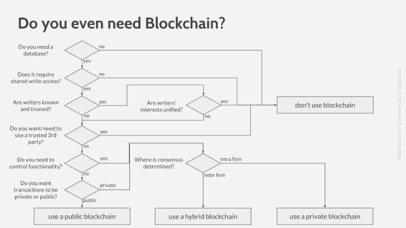

class: center, middle, inverse

# Final Presentation: 
## Feasibility of blockchain application as medium for collaborative systems or databases
### How to replace a previously thought indispensable middleman with technology

By Pelle Jacobs, August 29, 2017

Supervised by prof. Jochen De Weerdt and Vytautas Karalevicius

???

<!-- Main research question of my master thesis "How can the idea to replace a middleman with technology be applied to collaborative databases?" 
 -->
  
Main idea: how can we store collaborative data without the need for a trusted third party? 

start presentation with 
    `$ bs serve`

---

# Overview

1. Distributed databases:
    1. Centralized vs Distributed databases
    2. Consensus and immutability issues
    3. Blockchain as a solution ⛓
    4. Issues with blockchain

2. Proposals for centralized storage
    1. On-chain storage
    2. Distributed cloud storage
    3. Notary's testament services

3. Proposals for distributed storage
    1. On-chain storage
    2. Database timestamping

4. Conclusion

???
The proposals from my final chapter will be the focus of this presentation. 

I'll start out by going through some theoretical content on databases

I have a lot of slides, so I'll go through them quite quickly

If you have any questions related to what's a slide, just interrupt me

<!-- 
- I cherry picked the content from the prior research chapter with this in mind: what is absolutely necessary to evaluate the proposals

- For example, I left out the entire section on public key cryptography, the technicalities of blockchain technology and the less relevant distributed database parts (CAP, git, bittorrent, etc) 

I also split the proposals for collaborative storage into two sections: 

- proposals for centralized storage without a third party storage provider 

- proposals for distributed storage without a third party interaction manager
 -->
---

class: center, middle, inverse

# 1. Distributed databases 
## Section 2.3

---

.left-column[
  ## Centralized vs Distributed
]
.right-column[
Collaboration happens on both centralized as distributed databases

- Centralized: 

    - one main data storage node to which users connect to read and write.

    - storage can be physically one node (eg. 1 server) or virtual (eg. cloud storage)

- Distributed: 
    
    + every node can hold the data

    + no longer one single version of the truth 

  => creates interesting challenges: immutability and consensus
]

???
- challenges: these are specific for distributed databases. 

---

.left-column[
  ## Centralized vs Distributed
  ## Consensus & immutability
]
.right-column[
There are two main problems with distributed database that arise from the fact that data stored at different nodes will not be the same at all times

1. Consensus: when two different nodes simultaneously update the same data, which update is valid? The network has to pick which 'fork' is valid

    _remark: in centralized system, consensus is never a problem_

2. Immutability: once agreed upon, stored data can never be changed

    _remark: in centralized system, immutability issue cannot be solve_

Illustration: double spending problem
]

???

### Immutability
- not necessarily a problem: some databases need delete functionality. 
- however, it gets dangerous once a malicious agent can make changes to the data, without going through consensus process.

### An illustration: 
double spending: ie. not spending the same digital coin twice 

- if consensus is not properly solved: a malicious agent spends the same coin with two different merchants
- if immutability is not solved: 
    - a malicious agent spends the coin,
    -  merchant wait until network reaches consensus on validity of transaction, 
    -  afterwards the malicious agent changes the database undoing the transaction

---

.left-column[
  ## Centralized vs Distributed
  ## Consensus & immutability
  ## Blockchain as solution
]
.right-column[
Blockchain technology solves both problems quite well: 

1. Consensus: consensus algorithms are designed such that data forks are resolved as quickly as possible

2. Immutability: 
    - To change past data, a malicious fork needs to be longer than the current blockchain

    - Only works for sure with more than 50% of the network

    - If only 25% is controlled, only 0.1% chance an attacker would succeed in catching up to 15 blocks.

    => Although an attack is theoretically possible, it is very unlikely this would be economically profitable for the attacker, considering the required resources
]

---

.left-column[
  ## Centralized vs Distributed
  ## Consensus & immutability
  ## Blockchain as solution
  ## Issues with blockchain
]
.right-column[
Some practical issues with blockchain:

1. Scalability: New data can never be deleted, so the database constantly increases in size. There are several solutions being proposed

    - Segregated witness: put the witness data into a separate block. Witness data is only necessary on validation, it can be deleted from main storage after a while

    - Sharding: split the blockchain in several parts ('shards') and nodes can decide to only hold a specific shard

1. Latency: Using Bitcoin's block frequency (10 min per block), a merchant should wait 30 minutes before approving a trade

1. Privacy (for public chains): Although data can be encrypted, metadata is publicly visible

1. Delete functionality: Some applications require delete functionality, eg. European "Right to be Forgotten"

]

---

class: center, middle, inverse

# 2. Proposals for centralized storage
## Sections 4.1, 4.2 and 4.3

???

In the next two section I'll discuss proposals to cut out a middleman when dealing with collaborative storage

In this section, I'll talk about how to avoid a centralized storage provider when dealing with centralized storage

Example: the recipe of coca-cola, or the trading algorithm for a bank
 
 =>  highly secret, only a few people can access or change it.

---

.left-column[
  ## On-chain storage
]
.right-column[
Store data directly onto a blockchain, preferably a secure, public blockchain.

Several problems with this approach: 

1. All the disadvantages of blockchains as discussed previously: scalability, privacy, high latency, and delete functionality.

  => could be issues for centralized storage applications

1. Because storage capacity of blockchain is limited, storing normal-sized files is quite expensive: 

  On Bitcoin blockchain: around €6.50 per KB .red[*]

1. The strength of blockchain is solving the consensus and immutability issues 

  => not relevant for centralized storage
]

.footnote[.red[*] considering a transaction cost of 0.0000026 BTC per byte and a BTC market cap of €2418.09]

---

.left-column[
  ## On-chain storage
  ## Distributed cloud storage
]
.right-column[
Instead of storing data at a single trusted storage provider (eg. Dropbox)
 
=> use a network of storage providers ('hosts')

### Process: 

1. divide data into small pieces
1. send pieces to different hosts and duplicate for redundancy
1. request data from hosts when necessary

### Problems: 

- Host is not guaranteed to actually store the data
- Host has no guarantee he will be paid by the storage renter

Several implementations of same idea: Storj, Siacoin, Filecoin, IPFS, Maidsafe
]

???
"Where is SWARM"
leave out swarm because they are still in early development and it is not completely clear what their exact ambition is

---

.left-column[
  ## On-chain storage
  ## Distributed cloud storage
]
.right-column[
## Implementation 1: Storj

Uses a pay as you go scheme: 
renter asks the host for a proof of storage that they still hold data: 

- *renter receives proof*: renter pays host for storage
- *renter does not receive proof*: renter assumes data is gone and reduplicates
- *host does not receive payment*: host assumes data does no longer need to be stored

### Problems: 

1. Denial of service (DoS) attack: malicious renter stores large amounts of data without paying for first proof of storage

2. Sybil attack: 
  - malicious agent pretends to be multiple different hosts
  - renter stores data with him while thinking data is securely distributed
]

???

"why not go further into this?"

Not single focus of thesis, all very recent technologies

---

.left-column[
  ## On-chain storage
  ## Distributed cloud storage
]
.right-column[
## Implementation 2: Siacoin

Uses blockchain to support storage network with smart contracts:

-  renter puts in payment for storage
-  host puts in a collateral in case he cannot produce a proof of storage

Extra: before being eligible to store data, hosts are required to proof their authenticity by burning coins

### Advantages: 

- Secure against DoS attack and Sybil attack
- Hosts' performance is publicly available and hosts can be paid accordingly

]

---

.left-column[
  ## On-chain storage
  ## Distributed cloud storage
  ## Notary's testament services
]
.right-column[

### Purpose:

Replace notary's testament service with  
public key cryptography + blockchain + regular lawyer

### What is replaced:

1. Signature witnessing

2. Testament secret keeping

### Why: 

- A single trusted third party, in this case the notary, always implies a single point of failure. 

- Current notary system is a government oligopoly  
  reduced competition => worse service for higher cost

]

???

This proposal is more applied than the general description of the others. 

The example can however easily be projected onto other 'proof of existence' problems

---

.left-column[
  ## On-chain storage
  ## Distributed cloud storage
  ## Notary's testament services
]

.right-column[
### 1. Digital signature

1. Testator writes testament together with a regular lawyer to ensure correct wording
2. Testator signs testament with digital signature
3. Testator distributes signed testament among potential stakeholders

### 2. Proof of existence with simple blockchain

Improve security by storing a fingerprint on a public blockchain

### 3. Secret keeping with Turing complete blockchain

Encrypt testament and use a ÐApp to release decryption key once the testator is deceased.  
Several ways to write ÐApp script, eg.: 

- Have multiple stakeholders vote, with a veto to the testator
- Have the ÐApp routinely ask a governmental database whether the testator has been declared deceased 
]

???

### 2. proof of existence

eg. case in which after death testament is signed

### 3. ÐApp script: 

several aspects to take into account: 

- cost: how much ether does it cost to power the script?
- security: what is the chance that the script would fail, how to solve?

---

class: center, middle, inverse

# 3. Proposals for distributed storage
## Sections 4.4 and 4.5

???

- In this final section, I'll discuss proposals on how to possibly remove a third party interaction manager when dealing with distributed storage

- it is important to note that these are proposals to solve the incentive issues between peers.

---

.left-column[
  ## On-chain storage
]
.right-column[

### Characteristics of potential use cases: 

1. Incentive issues between peers result in immutability and / or consensus issues

2. Downsides of blockchain technology are not an issue: 

  - Scalability: no large amounts of data need to be stored

  - Latency: immutability is preferred over immediate consistency

  - Delete functionality: not critical

Often these cases require custom, private blockchain implementations, in which privacy is not a concern.

]

---

.left-column[
  ## On-chain storage
]
.right-column[
## Example: Intercompany blacklist

Industry decides to create a collective blacklist with bad clients to prevent shopping between companies   
To avoid abuse of the blacklist, participating companies are fined if they add good clients are do not add bad clients

### Incentive issue between peers?
Companies are incentivized to tamper with the database in order to avoid fines if there is no enforced immutability

### Drawbacks of blockchain?

- Scalability: only a bad client identification is stored

- Latency: real-time data is not necessary

- Delete functionality: a bad client could be technically removed from the database when a company submits a 'vouching' transaction, vouching for this client.   
  ⚠️ European "Right to be Forgotten"

]

???

"How is check done?"

By regular audit, taking a sample of clients and checking whether the company added them to the blacklist or not. 

Eg. could authorize their independent audit companies to report to the industry committee

---

.left-column[
  ## On-chain storage
]
.right-column[
## Example: Intercompany blacklist (cont.)

### Check: how would a centralized solution perform?
A centralized solution would need an impartial committee to ensure the immutability of the blacklist. However:
  
  - human committee would be a significantly higher cost than a blockchain implementation. 

  - every human committee can theoretically be corrupted  
  => immutability is not guaranteed

]

---

.left-column[
  ## On-chain storage
]
.right-column[

### Aside: "Should I use blockchain" flowcharts

Most "Should I use blockchain" flowcharts are a variation on this aspect.

For example, from [www.multichain.com](https://www.multichain.com):

.small[(G. Greenspan, "Avoiding the pointless blockchain project", 2015)]

]

---

.left-column[
  ## On-chain storage
  ## Database timestamping
]
.right-column[
An alternative to on-chain storage when need for larger amounts of storage or delete functionality

### Process

1. Every peer in the network starts with the same database

2. When a peer updates his database, he propagates this change through the network

3. Other peers can implement this update, or decide not to if there is a conflict with their version of the database

4. Different database versions start to gradually differ

5. To resolve these differences, peers come together to manually agree on a consensus

6. Once consensus is achieved, a fingerprint of the new database is signed by all peers and is stored on a public blockchain  
=> Restart from step 1

]

---

.left-column[
  ## On-chain storage
  ## Database timestamping
]
.right-column[
### Ensured immutability

If there is ever a disagreement on a past version of the database: 

1. the peer reconstructs the version of the database (eg. because he stored a version locally)

2. if the fingerprint of this database matches the fingerprint stored on the public blockchain   
=> has to be correct database, as all peers signed the fingerprint

### Disadvantages

- Costly: consensus process is a manual process that could take a while

- Data cannot be changed during consensus process

- Very high latency: only agreed upon data is guaranteed correct

]

---
class: center, middle, inverse

# 4. Conclusion

---
# 4. Conclusion

- In context of collaborative storage, technology already provides several alternatives to replace trusted third parties

- Adoption: 
  - in private environments: the sky is the limit

  - in public environment: already possible, only matter of time until judiciary has to decide on a precedent and blockchains are incorporated into the law

- Several topics that can be further expanded on: 
  + Distributed cloud storage: industry is under active development  
  eg. ICO of Filecoin on August 10.  
    => interesting to do technical and business analysis

  + Blockchain scalability: core blockchain problem to currently solve. Improving scalability would result in:
      1. cost reduction for current blockchain applications (=> adoption)
      2. feasibility for new blockchain applications

???

Something interesting

---
count: false

class: center, middle, inverse

# Questions 💡

???

"Can you give an example of an interaction manager"
 
there are several proposals involving blind signature that require a central third party to clear transactions. eg. in digital cash

but often the problem interaction problem is solved by creating a central authority that has power over the entire system, effectively creating centralized storage instead of distributed storage

=> eg. Github authority for git: only one version of the data that is valid 

---
count: false

class: center, middle, inverse

# Thank you 🎉

---
count: false
# References

-  Rivest, R.L. and Shamir, A. and Adleman, L.M. US Patent 4,405,829 issued in 1983
-  Cipher, C., & Cipher, M. (2004). Introduction to cryptography. EEC, 484, 584.
-  Calderbank, M. (2007). The RSA Cryptosystem: History, Algorithm, Primes.
-  Bischoff, P. (2017). What is Blockchain? 10 experts attempt to ex- plain it in 150 words or less. Comparitech. Retrieved 20 July 2017, from https://www.comparitech.com/blog/information-security/what-is-blockchain- experts-explain/
-  Antonopoulos, A. M. (2014). Mastering Bitcoin. Sebastopol, CA.
-  Rouse, M. (February 2006). What is data structure? - Definition from WhatIs.com. SearchSQLServer. Retrieved 20 July 2017, from http://searchsqlserver.techtarget.com/definition/data-structure
-  Abelson, H. et al. (1996). Structure and Interpretation of Computer Programs. MIT Press.
-  Swan, M. (2015). Blockchain: Blueprint for a new economy. O’Reilly Media, Inc.
-  Bitfury Group (2015). Proof of Stake vs Proof of Work
-  CryptoCurrency Market Capitalizations. (2017). Coinmarketcap.com. Retrieved 20 July 2017, from https://coinmarketcap.com/currencies/

---
count: false

-  Alternatives for Proof of Work, Part 2: Proof of Activity, Proof of Burn, Proof of Capacity, and Byzantine Generals Bytecoin Blog. (2017). Bytecoin: private secure financial system. Retrieved 19 July 2017, from https://bytecoin.org/blog/proof-of- activity-proof-of-burn-proof-of-capacity/
-  Bitfury Group (2015). Public versus Private blockchains. Part 1: Permissioned Blockchains.
-  Desmedt, Y. (2011). Man-in-the-middle attack. In Encyclopedia of cryptography and security (pp. 759-759). Springer US.
-  Nakamoto, S. (2008). Bitcoin: A peer-to-peer electronic cash system.
-  Bitcoin (BTC) price, charts, market cap, and other met-
rics — CoinMarketCap. (n.d.). Retrieved July 19, 2017, from https://coinmarketcap.com/currencies/Bitcoin
-  Chen, L. Y., & Nakamura, Y. (2017, July 10). Bitcoin Is Having a Civil War Right as It Enters a Critical Month. Retrieved July 19, 2017, from https://www.bloomberg.com/news/articles/2017-07-10/Bitcoin-risks- splintering-as-civil-war-enters-critical-month
- Hash Rate - Blockchain. (n.d.). Retrieved July 19, 2017, from https://blockchain.info/charts/hash-rate
-  Bauer, M. R. (2017, April 14). Quantum Computing is going commercial with the potential to disrupt everything. Retrieved July 19, 2017, from http://www.newsweek.com/2017/04/21/quantum-computing-ibm-580751.html
-  Loibl, A. (2014). Namecoin. namecoin. info.
-  Buterin, V. et al. (2017). Proof of Stake FAQ. URL https://github.com/Ethereum/wiki/wiki/Proof-of-Stake-FAQ

---
count: false

-  Buterin, V. (2013). Ethereum white paper.
-  Kepser, S. (2004, August). A Simple Proof for the Turing-Completeness of XSLT and XQuery. In Extreme Markup Languages. Chicago
-  Baran, P. (1964). On distributed communications networks. IEEE transactions on Communications Systems, 12(1), 1-9.
-  Fox, A., & Brewer, E. A. (1999). Harvest, yield, and scalable tolerant systems. In Hot Topics in Operating Systems, 1999. Proceedings of the Seventh Workshop on (pp. 174-178). IEEE.
-  Gilbert, S., & Lynch, N. (2002). Brewer’s conjecture and the feasibility of consistent, available, partition-tolerant web services. Acm Sigact News, 33(2), 51-59.
-  Chacon, S., & Straub, B. (2014). Pro git. Apress.
-  How can I change the author (name / email) of a commit? (2017). Git-tower.com. Retrieved 21 July 2017, from https://www.git-tower.com/learn/git/faq/change- author-name-email
-  About pull requests - User Documentation . (2017). Help.github.com. Retrieved 21 July 2017, from https://help.github.com/articles/about-pull-requests/
-  Cohen, B. (2003, June). Incentives build robustness in BitTorrent. In Workshop on Economics of Peer-to-Peer systems (Vol. 6, pp. 68-72).
-  Andersson, J. (2009). For the good of the net: The Pirate Bay as a strategic
sovereign. Culture Machine, 10. Chicago
-  Goland, Y. Y. (March 8, 2017). The block chain and the CAP Theorem. Retrieved 21 July 2017, from http://www.goland.org/blockchain and cap

---
count: false

-  Hashrate Distribution. (2017). Blockchain.info. Retrieved 21 July 2017, from https://blockchain.info/pools
-  Confirmation - Bitcoin Wiki. (2017). En.Bitcoin.it. Retrieved 21 July 2017, from https://en.Bitcoin.it/wiki/Confirmation
-  Gornick, S. (March 13, 2013). How many confirmations do I need to ensure a transaction is successful?. Bitcoin.stackexchange.com. Retrieved 21 July 2017, from https://Bitcoin.stackexchange.com/a/8373/47645
-  James-Lubin, K. (2015). Blockchain scalability. O’Reilly Media. Retrieved 21 July 2017, from https://www.oreilly.com/ideas/blockchain-scalability
-  Ethereum / Ether (ETH) statistics - Price, Blocks Count, Difficulty, Hashrate, Value. (2017). Bitinfocharts.com. Retrieved 21 July 2017, from https://bitinfocharts.com/Ethereum/
-  Wuille, P. (2015). Segregated witness and its impact on scalability. In SF Bitcoin Devs Seminar.
-  Buterin, V., et al. (2017). Sharding FAQ. Retrieved 20 August 2017, from https://github.com/ethereum/wiki/wiki/Sharding-FAQ
-  FAQ - OpenBazaar Docs. (2017). Docs.openbazaar.org. Retrieved 21 July 2017, from https://docs.openbazaar.org/09.-Frequently-Asked-Questions/
-  Shared folders: Give people edit access to your files. (2017). Dropbox.com. Retrieved 22 July 2017, from https://www.dropbox.com/help/files-folders/share-with-others
-  Bitcoin Fees for Transactions — Bitcoinfees.21.co. (2017). Bitcoinfees.21.co. Re- trieved 22 July 2017, from https://Bitcoinfees.21.co/
-  Douceur, John R. (2002). The Sybil Attack. Springer Berlin Heidelberg

---
count: false

-  Wilkinson, S., Boshevski, T., Brandoff, J., & Buterin, V. (2014). Storj a peer-to-peer cloud storage network. Chicago
-  Vorick, D., & Champine, L. (2014). Sia: Simple Decentralized Storage.
-  Protocol Labs (2017). Filecoin: A Decentralized Storage Network.
-  Benet, J. (2014). Ipfs-content addressed, versioned, p2p file system. arXiv preprint arXiv:1407.3561.
-  Irvine, D. (2010). Maidsafe distributed file system.
-  Aan welke voorwaarden moet een eigenhandig testament voldoen?. (2017). Notaris.be. Retrieved 7 August 2017, from https://www.notaris.be/faq/erven- schenken/aan-welke-voorwaarden-moet-een-eigenhandig-testament-voldoen
-  Notary Public vs. Lawyer: What’s the Difference?. (2015). Downtown Notary Toronto. Retrieved 7 August 2017, from http://downtownnotarytoronto.com/the- notable-blog/2015/6/22/notary-public-vs-lawyer-whats-the-difference
-  De Cock, D. (April 2017). Belgian eID cards & ePassports.

